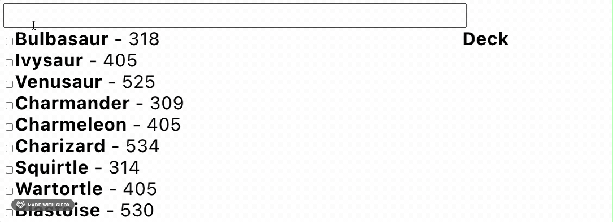
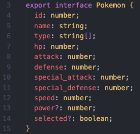
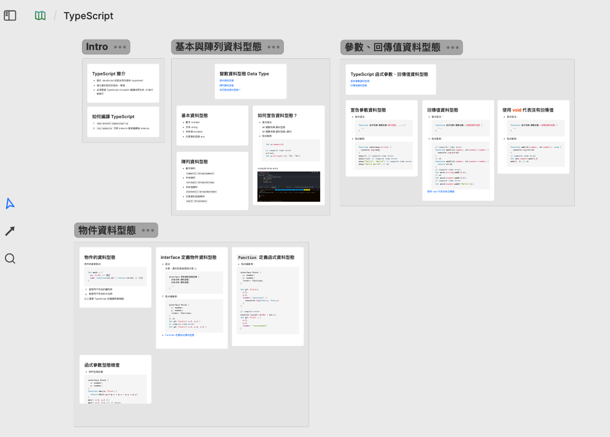

# 使用 RxJS, TypeScript 製作 Pokemon Search Bar, Deck

## Demo


## 該專案想要練習的技術
1. rxjs
2. TypeScript
3. observable-hooks: 

## RxJS 的概念與相關用法
RxJS 是一個用於處理非同步事件與數據流的 library，基於「觀察者 (Observable) 模式」。

#### $ 符號 的意義
在 rxjs 中的 $ 符號是一種約定成俗的命名方式，用來表示這是一個 Observable 物件

**程式碼範例**
```javascript=
export const rawPokemon$ = new BehaviorSubject<any>([]);
```

#### pipe() 的用法
pipe() 是 rxjs 用於連接 operators 方法，用來將 Observable 物件進行串接

**程式碼範例**
```javascript=
export const pokemonWithPower$ = rawPokemon$.pipe(
map((pokemon) =>
	pokemon.map((p: Pokemon) => ({
	...p,
	power:
		p.hp +
		p.attack +
		p.defense +
		p.special_attack +
		p.special_defense +
		p.speed,
	}))
)
);
```
#### combineLatestWith 的用法
combineLatestWith 是運算子，用於將多個 Observable 的最新值組合成一個新的 Observable。

**程式碼範例**
```javascript=
export const pokemon$ = pokemonWithPower$.pipe(
  combineLatestWith(selected$),
  map(([pokemon, selected]) =>
    pokemon.map((p: Pokemon) => ({
      ...p,
      selected: selected.includes(p.id),
    }))
  )
);
```

#### useObservableState 用法
**程式碼範例**
```javascript=
const Deck = () => {
  const deck = useObservableState(deck$, []);
  return (...);
};
```

## 該專案用到的 TypeScript interface


## TypeScript 筆記
發佈在個人 Heptabase 心智圖筆記
[TypeScript 筆記連結](https://app.heptabase.com/w/8916a1ef3eeedf17ab4a095d61a6268f5eedd32cb7f910ee99f8b7b23de75bd6)



## 其他 RxJS 筆記
該部分筆記內容由 ChatGPT 生成
| Title & Link |
| ------------ |
| [BehaviorSubject](./notes/BehaviorSubject.md) |
| [什麼是 RxJS](./notes/什麼是%20RxJS.md.md) |

## 參考資源
- [React + RxJS = Reactive Global Goodness](https://youtu.be/s6nG0byDI-o?si=1IbZLKjayc75UwSo)


